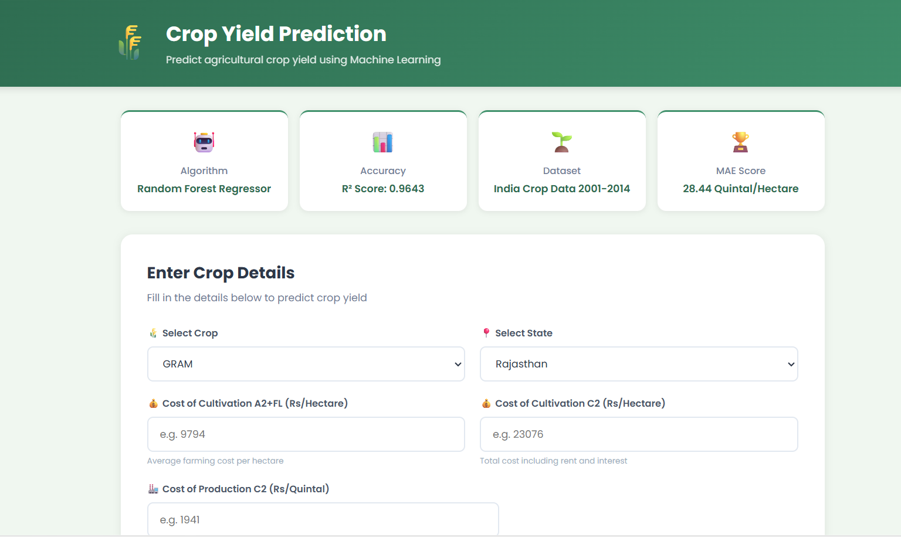
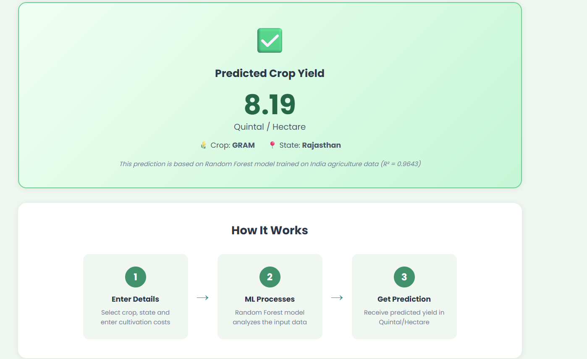

# 🌾 Crop Yield Prediction Web App

A simple web application that predicts agricultural crop yield using Machine Learning.

## 📁 Project Structure
```
crop_prediction_app/
├── app.py                ← Flask backend (main file)
├── datafile (1).csv      ← Dataset
├── requirements.txt      ← Required libraries
├── templates/
│   └── index.html        ← Frontend HTML page
└── static/
    └── style.css         ← CSS styling
```

## 🛠️ Tech Stack
- **Frontend** : HTML, CSS
- **Backend**  : Python, Flask
- **ML Model** : Random Forest Regressor (Scikit-learn)
- **Dataset**  : India Crop Production Data 2001-2014

## 📊 Model Performance
| Metric | Score |
|--------|-------|
| R² Score | 0.9643 |
| MAE | 28.44 Quintal/Hectare |

## ▶️ How to Run

### Step 1 — Install libraries
```bash
pip install -r requirements.txt
```

### Step 2 — Run the app
```bash
python app.py
```

### Step 3 — Open browser
```
http://127.0.0.1:5000
```

## 💡 How It Works
1. User selects crop and state from dropdown
2. User enters cultivation costs
3. Flask sends data to Random Forest model
4. Model predicts yield in Quintal/Hectare
5. Result displayed on the webpage


## Screenshots




## 📈 Key Findings

- Sugarcane has highest yield (~1000 Quintal/Hectare)
- Tamil Nadu has highest cultivation cost (~43,000 Rs/Hectare)
- Cost of Cultivation C2 has strongest correlation with Yield (0.87)
- Random Forest predicted ARHAR yield as 9.82 vs actual 9.83 — only 0.01 difference!

---
## Images


## 🚀 Future Improvements

- Deploy on Render.com for public access
- Add charts showing feature importance
- Integrate weather data as additional feature
- Add more crops and states with larger dataset


## 👩‍💻 Built By
**Akarshi Srivastava**
UCT upSkill Campus — DS and ML Internship 2026


## 🙏 Acknowledgements

- Dataset: India Agriculture Data — data.gov.in (fully licensed)
- UCT upSkill Campus for project guidance

---
